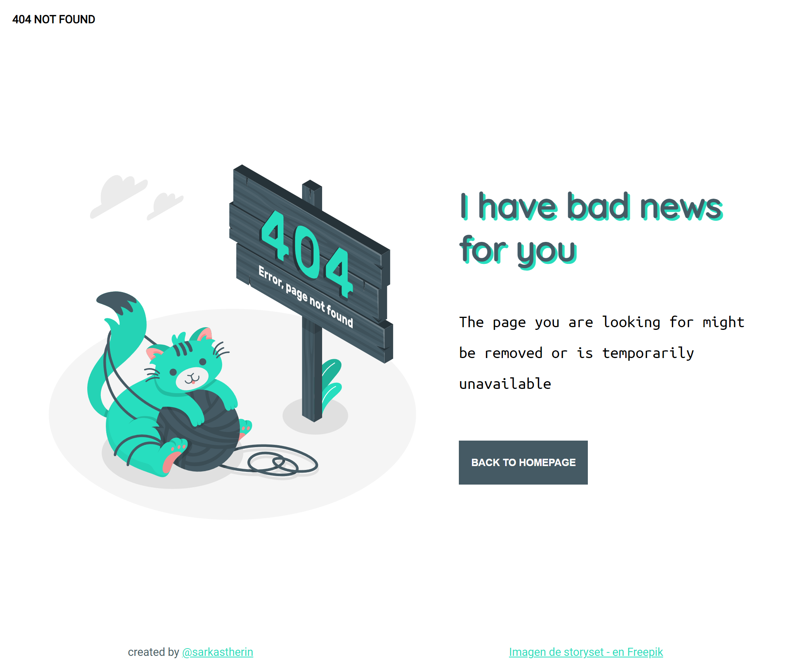

# 404 NOT FOUND PAGE

This repository offers you a charming solution to handle those pesky 404 errors. Why settle for a simple error message when you can enjoy the company of an adorable kitten? Because no one likes 404, but we all love kittens! This touch of charm adds a bit of joy to a frustrating situation. We hope this page makes those 404 errors a little more bearable for your visitors!

## Overview

I enjoyed making this page a lot. I love kittens, well, I suppose everybody loves them.

## Built with
- **HTML:** For structure and content
- **CSS:** For styles, colors, and design.
- **IMAGE:** The adorable Kitten, was taken from [Freepik](https://www.freepik.es) at this [link](https://www.freepik.es/vector-gratis/ilustracion-concepto-error-404-lindo-animal_7906236.htm#query=404%20not%20found%20cat&position=4&from_view=search&track=ais)
## Features

- Attractive and responsive design that provides a pleasant user experience.
- Clear 404 error message with a button to return to the homepage.
- Adorable kitten image that adds a touch of charm to the error page.

## Demo

[See my demo](https://sarkastherin.github.io/404-not-found/)

## License

[MIT](https://choosealicense.com/licenses/mit/)

## Feedback

If you have any feedback, please reach out to me kathejudith@gmail.com

## Contact
- GitHub [@sarkastherin](https://{github.com/sarkastherin})
- Twitter [@sarkastherin](https://{twitter.com/sarkastherin})